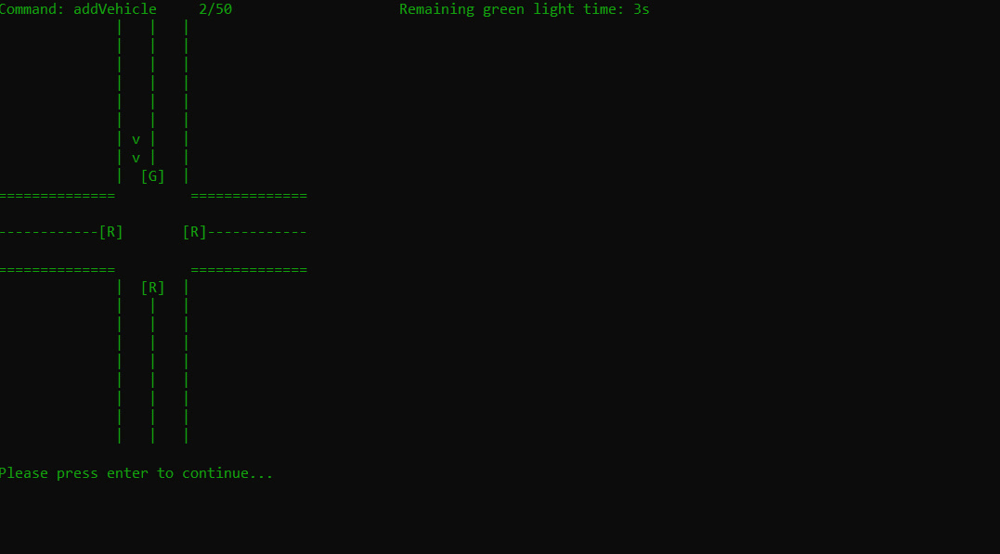

# *A*daptive *V*ehicle System
## Czym jest Adaptive Vehicle System?

Jest to symulacja inteligentnych świateł drogowych na skrzyżowaniu, które składa się z czterech dróg dojazdowych: północ, południe, wschód i zachód. Jej przebieg definiowany jest poprzez listę komend w postaci pliku JSON. Każda komenda definiuje akcję, jaką system ma wykonać na skrzyżowaniu. Przykładowa struktura jest następująca:

```json
{
  "commands": [
    {
      "type": "addVehicle",
      "vehicleId": "vehicle4",
      "startRoad": "west",
      "endRoad": "south"
    },
    {
      "type": "step"
    },
    {
      "type": "step"
    }
  ]
}
```

* Komenda addVehicle: dodaje pojazd na wskazanej drodze początkowej (startRoad) z celem dojazdu do drogi końcowej (endRoad).
* Komenda step: wykonuje krok symulacji, podczas którego przez skrzyżowanie przejeżdżają pierwsze pojazdy na drodze, która aktualnie ma zielone światło.

Ze względu na przyjętą logikę komendy step(), jakiekolwiek aktualizacje obecnego stanu świateł drogowych, czasu oczekiwania i priorytetów muszą być wykonywane synchronicznie w ramach pojedynczego wywołania tej metody, aby zachować spójność symulacji. Oznacza to, że komenda addVehicle powoduje tylko i wyłącznie dodanie samochodu na wskaznej drodze. Wynikiem symulacji jest JSON zawierający listę pojazdów, które opuściły skrzyżowanie po każdym kroku symulacji.
```json
{"stepStatuses": [
  {"leftVehicles": ["vehicle1"]},
  {"leftVehicles": ["vehicle2"]},
  {"leftVehicles": []},
  {"leftVehicles": []},
  {"leftVehicles": []}
]}
```
## W jaki sposób działa symulacja i algorytm zmiany świateł?

Symulację można uruchomić poprzez konoslę. W tym celu należy przejść do folderu i wpisać komendę:
```sh
java -jar target/Traffic_Simulation_demo-1.0-SNAPSHOT-shaded.jar input.json output.json
```
Gdzie:
* input.json - ścieżka lub nazwa pliku z komendami,
* output.json - nazwa pliku wyjściowego.

Jeżeli wszystko zostało poprawnie wykonane, użytkownikowi zostanie prosta wizualizacja zdefiniowanej symulacji z kluczowymi informacjami o obecnym i przyszłym stanie.



Algorytm składa się z dwóch kluczowych funkcji:

* ```getBusiestRoad() ``` – wybiera drogę, dla której światło zmieni się na zielone. wybiera drogę, na której zmieni się światło na zielone, kierując się: liczbą pojazdów, priorytetem drogi oraz czasem oczekiwania.
  - jeśli nie ma żadnych pojazdów (totalVehicles == 0), światła zmieniają się sekwencyjnie (po kolei),
  - każda droga ma przypisaną wagę (weight), którą oblicza się jako: weight = 2 × liczba pojazdów + priorytet drogi. Wybierana jest droga z największą wagą,
  - jeśli dwie drogi mają ten sam weight, wybierana jest ta, która dłużej czeka na zielone światło (waitTime).
    
* ```calculateGreenDuration(String direction) ``` – ustala czas trwania zielonego światła na podstawie udziału pojazdów na danej drodze w stosunku do wszystkich pojazdów na skrzyżowaniu.
  - jeśli na skrzyżowaniu nie ma pojazdów, zwracany jest minimalny czas zielonego światła (MIN_GREEN_DURATION).
  - jeśli są pojazdy, algorytm oblicza nowy czas zielonego światła na podstawie stosunku: liczba pojazdów na drodze/liczba pojazdów na skrzyżowaniu,
  - nowy czas światła oblicza się jako: MIN_GREEN_DURATION+(MAX_GREEN_DURATION−MIN_GREEN_DURATION)×ratio,
  - ostateczna wartość jest przekształcona na int, aby nie było wartości dziesiętnych.

Algorytm został stworzony do zmiany światła na jednej drodze, dzięki czemu nie występują sytuacje konfliktowe, co niestety odbija się na wydajność skrzyżowania. Struktura kodu oraz zastosowanie podejścia obiektowego umożliwają przyszłą potencjalną modyfikacje pod kątem zmiany dwóch świateł na raz. 
